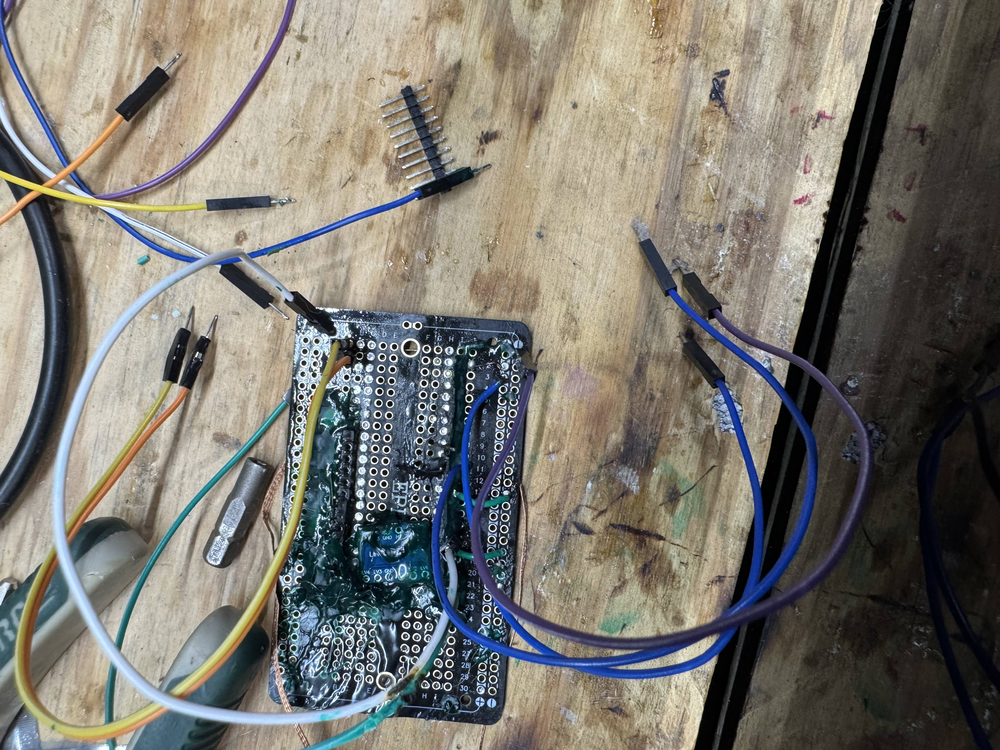
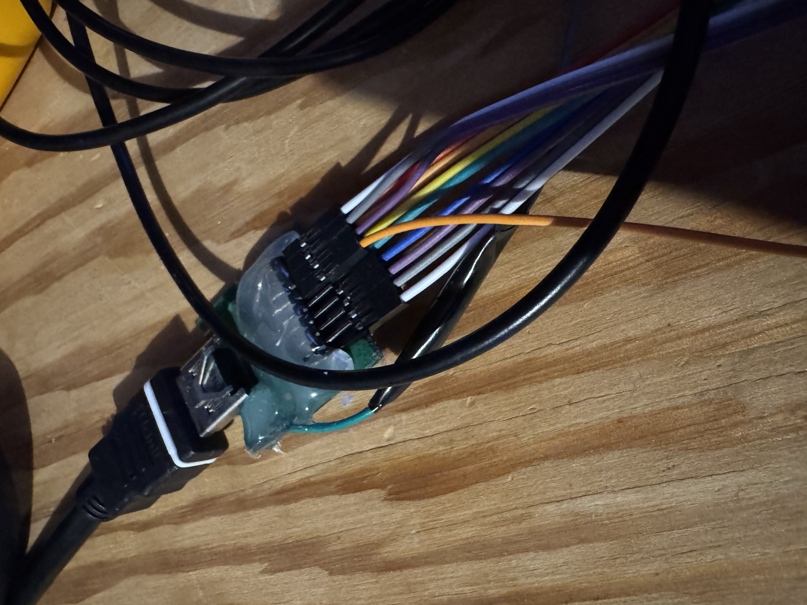

# Bit-Banging TMDS over HDMI via the Raspberry Pi Pico 2 written in Raw ARM v8m Assembly Code
Some people spend their free time hanging out with friends, some people read books, and some people sit at a desk in their room for three months creating a project that is doomed to fail from the get go. One of those three options accurately describes me.
 
## Table of Contents
- [Overview](#Overview)
- [Usage](#Usage)
- [Introduction](#Introduction)
- [EDID](#EDID)
- [Strings in Assembly Code](#Strings-in-Assembly-Code)
- [Debugger Broke](#Debugger-Broke)
- [Loading an image on the Pi Pico](#Loading-an-image-on-the-Pico)
- [Bit-Bang the Image](#Bit-Bang-the-Image)
- [Encoding TMDS: How it works](#Encoding-TMDS-How-it-works)
- [Encoding TMDS: How I did it](#Encoding-TMDS-How-I-did-it)
- [Encoding TMDS: Optimizing conversion](#Encoding-TMDS-Optimizing-conversion)
- [Encoding TMDS: Pre-Calculate TMDS](#Encoding-TMDS-Pre-Calculate-TMDS)
- [Identifying Problems, Attempting Solutions](#Identifying-Problems,-Attempting-Solutions)
- [Refactor Store in Flash](#Refactor-Store-in-Flash)
- [Run Length Encoding Part 1](#Run-Length-Encoding-Part-1)
- [Run Length Encoding Part 2: Regression is Progression in the End](#Run-Length-Encoding-Part-2-Regression-is-Progression-in-the-End)
- [Implementing a Hash Map](#Implementing-a-Hash-Map)
- [Chaining DMA Channels](#Chaining-DMA-Channels)
- [Handling a Buffer Overflow](#Handling-a-Buffer-Overflow)
- [Choosing a the Right Image](#Choosing-a-the-Right-Image)
- [Final Result](#Final-Result)
- [Anecdotes](#Anecdotes)
- [Conclusion](#Conclusion)

##	Overview
This was an attempt to make the Pi Pico 2 load a **24-bit** .bmp image and send it to a monitor via HDMI. I wrote this project mostly in ARM assembly code to maintain granular control of the system. I figured I would have better control over the use of each CPU cycle in Assembly Code. 

Some of the Raspberry Pi Pico 2 SDK functions were of the type inline static. For those functions, I made some wrapper functions in main.c. To some it up, all the code that does anything I wrote in raw assembly code, and the only C code I wrote were wrapper functions. I didn’t even use printf (which was I regret as it would have made my life so much easier).

Unfortunately, as of now, there isn’t any point running this code for yourself as it doesn’t really do anything. The minimum resolution supported according to **VISA HDMI 1.3** standards, is **640x480p** at **60hz**. This requires a pixel-rate around **25mhz** which works out to about **250mbps**. The Pi Pico 2’s clock-rate is **150mhz** meaning that even if one could write code to transfer 1 bit per clock cycle, the max transfer speed wouldn’t be fast enough.

However, I figured, may as well try. I was curious to see what would happen. So that’s what I did. I embarked on a three-month journey to try and try again to make a Pi Pico 2 bang bits out 8 pins as fast as it possibly could. Here’s how it went.

## Usage
Here are the requirements to run this project:
- Raspberry Pi Pico 2
- Raspberry Pi Pico 2 SDK (I used the VS Code extension)

Modifications to the CMakeLists.txt file:

```
# Add executable. Default name is the project name, version 0.1
add_executable(hdmi hdmi.c "hdmi.s" uart.s)

# Add any user requested libraries
target_link_libraries(hdmi 
    pico_stdlib
    pico_printf
    pico_stdio
    hardware_pio
    hardware_i2c
    hardware_dma
    hardware_flash
    hardware_gpio
    hardware_timer
    hardware_uart
    hardware_sync
)
```

Connect GPIO pins as fallows (this can be changed in the hdmi.s file):
```
UART
pin 0 = UART TX
pin 1 = UART RX
pin 19 = UART DTR (Only used when inhaling an image)

HDMI
pin 7 = Hot Plug Detect
pin 8 = TMDS Data 0+
pin 9 = TMDS Data 0-
pin 10 = TMDS Data 1+
pin 11 = TMDS Data 1-
pin 12 = TMDS Data 2+
pin 13 = TMDS Data 2-
pin 14 = TMDS Clock+
pin 15 = TMDS Clock-
```

The instructions are as fallows. Load an image into the Pico via serial, convert the image, then send it. Fallow the on-screen prompts to complete the correct commands.

## Introduction
One of the most difficult parts of this project was configuring a hardware solution that would (in theory) connect the Pico to an HDMI port. I cobbled this one together from bits and pieces I had laying around.

<picture>
    
</picture>

It consists of an HDMI port I cut off a PS4 with some soldered wires that are connected to the Pico. The Pico's highest voltage supplied to its GPIO pins is approximately **3.3v**. Most monitors require **5v**. So, I had to embark on a less-than-ideal side quest to find a proper logic level shifter that would raise or lower the voltage depending on the input. This allows the **3.3v** Pico to drive a **5v** monitor input. However, this only works if the logic level shifter is powerful enough. I started with the TXB0108 which I purchased from Adafruit. It didn’t work. Using an Oscilloscope, I couldn’t see any wave patterns after the logic level shifter.

<picture>
    
</picture>

After some research I found this manual, this statement, “the TXB0108 should not be used in applications such as I2C” (Texas Instruments, 2010). That took the wind out of my sales as I2C is exactly the communication I was trying to complete (two of the HDMI wires use I2C to communicate with the monitor for functions such as EDID, HDCP, and so on). This was an annoyance but I quickly found a better logic level shifter from Texas Instruments (actually from the TXB0108’s manual). According to Texas Instruments, “the TXB0108 should not be used in applications such as I2C or 1-Wire where an open-drain driver is connected on the bidirectional data I/O. For these applications, use a device from the TI TXS01xx series of level translators”. So that’s what I bought. The TXS0108. Its yet another 8-channel logic level shifter except this one has higher DC drive output (or so I thought). 

<picture>
    
</picture>
 
I went through the painful task of removing solder mask from my device (btw, never use solder mask on an unfinished prototype. Don’t ask how I know), unsoldering the old logic level shifter, then re-soldering the new level shifter, and reapplying solder mask (it would be a mess if I didn’t do this. Its basically like tech debt). I tested the new logic level shifter but to no avail. No change. I still didn’t see any wave patters after the logic level shifter. This confused me greatly and I spent an embarrassing amount of time chasing wild geese in an effort to discover the truth. 

I spent a lot of time configuring and reconfiguring the pin initialization and setup of the I2C protocol on the Pico, I tried connecting the controller to another device to ensure the things were setup properly. This test passed and I proceeded forward. I now knew that the code I wrote for the I2C connection worked correctly. Which means the issue must be within the hardware, but how? Texas Instruments themselves said the TXS0xxx series of logic level shifters are made to run I2C. Well, after doing some in depth research (In this case all I asked an LLM lol), I discovered that the logic level shifter I had been trying to use was meant to go between two chips that are physically close to each other. Not through a 50’ HDMI cable (a bit of an exaggeration). I then turned to the internet to see what people actually use to shift voltage and I discovered the MOSFET level shifter. 

<picture>
    
</picture>
 
I then discovered a **4-channel** level converter available on amazon that was more capable of shifting voltage up and down with a higher DC drive. This means, it can shift the level from **3.3v** to **5v** correctly in a way that the monitor on the other side will see the changes in voltage and be able to read the data. So, I bought a ton of these and went to town. Rinse and repeat with the process of removing the TXS0108 from the breadboard and connecting the MOSFET level shifter to it. It was quite a process and I had to use a microscope to see the wires I was soldering because of how small they were. 

I discovered during the installation that part of the reason why the TXS0108 never worked is because one of the wires had detached. I had no idea this happened because it was covered by solder mask (which is why I mentioned earlier that solder mask may not be a good idea in prototypes). 

Once installed, I ran the same test. It worked. The Pico was now communicating with the monitor without issue. I was now able to read the EDID data from the monitor so that I could interpret it and discover if this monitor would support the resolution it was trying to send.

##	EDID
At the time, the Pico was trying to output **848/480p**. The Extended Display Identification Data is necessary to read from the monitor in order to understand the possible resolutions that can be pushed to the monitor. This is readable via I2C on pins 15 and 16 of the HDMI port. Once I concurred the hardware issues in the communication layer between the monitor and the Pico, the Pico was now able to receive the raw **128-byte** long encoded EDID version 1.3 data. Now all that’s left is to decode the output and were off to the races! (Or so I thought). 

It turns out, parsing EDID version 1.3 is pretty complicated in assembly code. For example, if I were to write a parser in Python, the script would contain approximately a few hundred lines of code. My implementation in assembly code took well over **2000** instructions. There were many duplicate instructions. I choose to do it this way (effectively unrolling loops) because in assembly code, it's a lot easier to code the subtle changes in iterations of the loop if they are flattened out. 

For example, part of the EDID converts **10-bytes** into chromaticity data. The first two bytes are broken up into **2-bit** long chunks which are then concatenated to the rest of the bytes. In C the code to do this and return a buffer containing these bytes might look something like this:

<picture>
    
</picture>
 
Assembly code that does this same conversion:

<picture>
    
</picture>
 
As you can see, the assembly code instructions used here are much simpler and spread out instead of running a loop. So, this is part of the reason why it took so many instructions to parse this data in assembly code. To be clear, I did still use loops, but only where it was simpler to write it that way then to unroll a loop like I did with the chromaticity.

Now, the tricky part of this EDID decode job was all the branching. For example, the last 72ish bytes in the EDID 1.3, can be used in multiple different ways. It is broken up into **18-byte** chunks and each chunk can either be used as a detailed timing descriptor block or as a monitor descriptor block. Within these options are many different paths that can be taken depending on the manufacture’s specifications. So, it was a royal pain to implement every path that can be taken in the EDID description function. It was also rather difficult to verify all my code actually worked as intended. In fact, there is one path in particular that was not at all tested. There is a whole set of decode instructions to be used if the expected input would be analog instead of digital. This isn’t an intended use case for this project for multiple hardware incompatibility reasons, and because I don’t have a monitor that would read analog over HDMI. Anyways, about half the code I wrote to decode EDID got used by the monitor I used for testing.

##	Strings in Assembly Code
Now is as good a time as any to bring up strings. Strings require a lot of setup in assembly code depending on the approach.

<picture>
    
</picture>
 
Basically, mark a section as read only data, create a label, and attach to it a ```.asciz``` or ```.ascii``` with some text after it being careful to include new line characters and so on as needed. So this is how I wrote every string. It can be confusing to have random sections of read only data throughout the program so I put all of my strings at the top of the program. A very weird experience. 

Anyways, that’s the easiest part of string handling in assembly code. When the controller needs to print a string (over UART) I chose to pass the string a while loop function I wrote that transfers memory from one buffer to another until it hits a stop character. Then via some math, it is able to determine the length of the string and send that to the UART.

Now what if I want to add a value to the end the string like one might do in a printf statement? Well, the way my program does this, is it sends the number to a function that converts the number to ASCII characters and stores it in a buffer. 

<picture>
    
</picture>
 
After this my program adds the end of line ASCII character, does the math to get the buffer length, then the UART sends the data stream.

##	Debugger Broke
As mentioned, it took some time to write the assembly code to convert this EDID data into something useful. Once I had, I was ready to test my code and debug it. Unfortunately, the Pico sat dormant during this time and when I finally tried to use it again, I discovered my Pi Pico 2 had effectively died. Basically, it's debug port quite working. This means every time I tried to debug the Pico, OpenOCD (debugging software used to hardware debug the Pico remotely) would report that the hardware debugger couldn’t see any connected devices.

It took a lot of work to figure out what happened. I thought for sure I had some kind of short circuit or disconnected/bad wiring but I couldn’t find anything. I thought the issue must be software related so I installed the Pico SDK on another machine and the same thing happened. I eventually decided it had to be a wiring issue within my prototype board, which meant that I needed to remove the controller from the board and try the Pico by itself. I did this and unfortunately that made things so much work. I had my hot-air gun cranked and it not only melted the solder handing on all the pins that on the microcontroller, it also melted the solder that was holding all the chips down as well effectively erasing the entire board.

<picture>
    
</picture>
<picture>
    
</picture>


So now I had no choice but to buy some new micro controllers. I still was unsure what caused the debug port to brake initially but I was wondering if it might be my hardware debugger. The hardware debugger I used was a Raspberry Pi Pico 1 running a special Pico debug firmware that the Raspberry Pi foundation hosts on GitHub. So, I decided to try and bypass that issue by purchasing an official Raspberry Pi Pico Debug Tool and that is the hardware debugger I used for the rest of the project and that debugging port issue didn't return.

At this time, I took the opportunity to fully redesign the hardware solution that I had been using. My first prototype relied on solder for everything as seen in the photos above. This is great for keeping a good solid connection but for prototyping, it was very painful because I occasionally had to make a change that require some resoldering. My second prototype, was built with modularity in mind. I soldered pins everywhere instead of wires, which allowed me to easily change pin configuration spontaneously. I also soldered down a latching chip cradle that was a perfect fit for the Pico. 

<picture>
    
</picture>
<picture>
    
</picture>
  
This allowed me to remove the Pico from the board at the flip of a lever. The HDMI connecter was and is now on its own board with the same kind of reuseable wires attached to it. This enabled the HDMI connecter to be attached or detached as needed.

##	Loading an image on the Pico
I wasn’t sure if the Raspberry Pi Pico was powerful enough to inhale video and exhale TMDS to a display fast enough. My guess was probably not. However, I figured I may as well send one frame repeatedly as a starting point. So, I decided to use an image I had laying around, convert it to **848/480**, and export it as an **24-bit** RGB .bmp image that I could simply transfer to the Pico. However, there were several roadblocks in my way. First, a **24-bit** .bmp image at that resolution ends up at about **1.2MB** but the Raspberry Pi Pico 2 has **520KB** of ram. This means even if we used 100% of the Pico’s available RAM, the Pico can’t even hold one frame in memory. This was a problem as you might imagine but deciding to ignore itwith a simple TODO, I moved on to the second problem, which is that the image takes forever to transfer! 

When transferring at a baud of **1mbps** over UART (which is very fast for UART), it took about ten seconds to transfer the image to the Pico. This is way too long if I have any hope of sending video at some point. But, once again, I lowered the scope of the project and settled for just an image to send to the monitor. 

The third roadblock without spoiling things too much was the amount of variety I could include in the art of the image itself. But I saved this problem for later as well. 

Anyways, the end result was a **1.2MB** .bmp that I would transfer to the Pico over flow-control enabled UART. Yes, the Pico didn’t have enough space to store the whole uncompressed image in RAM, but who cares. I could simply export chunks to the **4MB** onboard flash memory. Plenty of space. It just took a little longer because writing to the onboard flash memory of the Pico transfers pretty slowly. Yeah it was slow, but it achieves the desired result of moving the image to the Pico.

##	Bit-Bang the Image
Okay, now that the micro controller has the EDID data, we can continue onto pushing frames to the monitor. First, I wish I could look you in the eye and say I wrote a program that inhales an image sent from computer over UART, converts the RGB data to TMDS **10-bit** bytes (I’ll explain later), loads buffers into the PIO (programmable input output block that runs asynchronously from the microcontroller CPU and has direct access to the GPIO lines) state machine FIFO and bit-bangs the image to screen in a weekend. Unfortunately, it took me over a month with several major refactors. I had no idea of the crazy ride I was about to embark on.

##	Encoding TMDS: How it works
Transition Minimized Differential Signaling (TMDS) is a method of transmitting data to monitors that allows for massive throughput. This technology was invented in the 90’s and is still in use to this day as one of the most common ways to transfer high-speed video/audio data over HDMI, or DVI. Here is how it works.
Let’s say we want to set a pixel to the color purple ```RGB: 157, 3, 252```. We would need to convert each byte into a **10-bit** long byte. 

We XOR the byte and take a count of the transitions between 1 and 0. 
For example, 

```XOR of 157 = 00101110```

It starts as a 1, transitions to a 0, stays that way for a while then back to a 1, then back to a 0, then back to a 1. So, it has 4 transitions. If the number of transitions is greater than 4, we want to use the NOT of the XOR aka NXOR. This would look like ```01111101```. So, we would choose which ever has the lesser number of transitions between 1 and 0.

The end result is recorded as a 1 or a 0 at the top of the converted byte so the monitor knows when it decodes a byte weather the byte was XOR or NXOR. For example,

The XOR of 157 = 00101110 and we concatenate a 0 on the top for XOR. 

```00101110 = 000101110``` (now 9 bits long)

The NXOR of 157 = 01111101 and we concatenate a 1 on the top for NXOR.

```01111101 = 101111101``` (now 9 bits long) 

After this we DC balance the **9-bit** byte by counting the number of 1s, checking the state of DC balance to discover whether we need to push more 1s or more 0s. Then we either concatenate, leave as 1s, and add a 0 to the top to tell the monitor not to flip the **9-bit**s, or we do flip the 9 bits and leave a 1 on the top to tell the monitor to flip the **9-bits** before proceeding.

Let’s say we needed to flip the byte. Here is the result.

```101111101 = 1010000010```

Otherwise, we would leave it as is and concat a 0.

```101111101 = 0101111101```

One simple method used to keep track of the deposit in 1s and 0s over the course of a transfer is simply via a bitmap. We can use an integer then simply add the amount of 1s and subtract by the amount of 0s. The goal is to keep the integer close to 0. If the Int is at -5, we would want to use more 1’s in the next result and if the number is 6 we would want to use less 1s and more 0s in the next result.

<picture>
    
</picture>

So that is how a byte is encoded as TMDS. This must be done for all three bytes in each pixel. The purple pixel from earlier, 
```157, 3, 252 = 10011101, 00000011, 11111100 -> 0100111110, 1011111101, 1011111001```

Now that we’ve covered the basics of TMDS encoding, lets backup a little bit and review my journey to discover a decent algorithm to use to encode TMDS in ARM assembly.

##	Encoding TMDS: How I did it
First, let me explain why I chose to process TMDS on the Pico instead of encoding the data beforehand. The answer is twofold. First, I wanted the Pico to be capable of receiving raw input and doing the rest of the work itself. That way it wouldn’t have to rely on specific input from a computer because at that point the computer may as well do all the work and not both with a micro controller. Second, a little embarrassing since this project never actually worked the way I intended, but this was/is supposed to be a portfolio project (for now) so the more I do the hard way, the better (it seems). Also, it really helped me learn a lot about low level programming which is invaluable.

Now I have a little secret to tell you. I didn’t bother doing any dc balancing in my program. It was unnecessary because of how slow the transfer rate would be. So, my assembly code TMDS conversion function would produce a result like this:
```0100111110, 0000000010, 0000001101```

This solution is ideal, but at the speed my micro controller goes it shouldn’t be necessary to dc-balance the TMDS bytes (famous last words). 

I started with the simplest approach I could think of which was loading a byte, branching to a routine that would convert the byte to an **8-bit** XOR or an **8-bit** NXOR (turns out my implementation was bugged and produced the wrong value. More on this in a bit), counting the number of 1s and branching based on the result and this would concat the **9th bit**, then I would concat a 0 as the **10th bit**.

After this began the arduous task of packing these bits into registers and then storing them in buffers that I would later send to the PIO. This part of the process was crazy and the reason why pertained to the method of exporting bits to the GPIO pins being used on the TMDS data lines. You see, the controller must bit-bang on eight lines simultaneously in order to transfer an image to the monitor. As mentioned, there are four pairs of lines to transfer trough and each pair gets a different part (RGB) of the pixel data. This looks like red and not-red, green and not-green, and blue and not-blue are the data lines. The last pair sends a clock signal. The idea is that the second line in each pair will always carry the exact opposite of the first line. The monitor at the end will take the difference in voltage between the two lines in each pair and evaluate as a 1 or 0 depending on the voltage output of the first line. 

The clock lines data requirements area predictable so I was able to make a self contained while true loop to flip-flop from 1 to 0 forever.

My first design of this program that actually worked involved one PIO state machine that would read six bits out of a **32-bit** word and send one of those bits to its each of its respective pins simultaneously. This meant I would need to pack six **10-bit** bytes into two **32-bit** words with one bit of a byte being pushed to the register every six bits (this would have been easier if my micro controller had more support for **64-bit** uints). 

For example, 
```
Tb1 = 00000000
Tb2 = 11111111
Tb3 = 00000011
Tb4 = 11111100
Tb5 = 00001111
TB6 = 11110000

32bitWord1 = 011010 011010 010110 010110
32bitWord2 = 101010 101010 101010 101010
```

The number instructions necessary to pull this off in assembly was quite high. Here’s what it did. 

<picture>
    
</picture>
 
Now this code unfortunately was written when I misunderstood how TMDS worked so this function produced dubious TMDS bytes. This is because at the time I didn’t understand how I was to produce the XOR or NXOR result. I thought it was supposed to be XOR’d against a byte of 1s. I also thought the NXOR could simply be a bitwise NOT of the result of the XOR. Wrong on both counts as I would find out latter on. The reason why I didn’t know exactly how to do this is because I for the longest time couldn’t find any documentation or instructions online explaining how to encode TMDS. So, I resorted to asked an LLM how its done. A combination of LLM’s hallucinations and my misinterpretations lead me to a place of confusion and despair. 

<picture>
    
</picture>
 
This was my first attempt to convert an entire horizontal line of the frame to TMDS and then store and return. It was very inefficient if you can’t tell. I would say the biggest mistake I made from a performance perspective here was the loop of ands, shifts, and orrs. That implementation was perhaps the most inefficient way to achieve the desired result. In fact, once I got the entire image bit-banging it took **2.2 seconds** to run an image using this method of on-the-fly translation. At this point I decided to reduce the output from **848/480** to **640/480** which is probably one of the lowest resolutions that HDMI monitors accept. This improved the transfer rate to about **1.9 seconds**.

## Encoding TMDS: Optimizing conversion

This is obviously too slow so I had to figure out what was causing the slowdown. The first thing I changed that made a big difference was this branch. Instead of using **AND**, **LSR**, **ORR**, and **LSL** to grab the bits I wanted, move them over, then put where they should go, I used, **UBFX**, **EOR**, and **BFI**.

<picture>
    
</picture>
 
This increased the framerate by more than **200%**, transferring the image in just under a second which is a massive improvement. This worked because of the amount of CPU cycles it takes to complete an **AND**, **ORR**, **LSL**, and **LSR** compared to **UBFX**, **EOR**, and **BFI**. **UBFX** and **BFI** which complete their entire task in **1 cycle**. AND and ORR take much longer.

## Encoding TMDS: Pre-Calculate TMDS

This was a massive improvement! However, one second to transfer a frame is still way too slow which meant I needed to find a way to further optimize this conversion. This was tuff as I didn’t really know what I could change. It seemed like all the things that my code was doing were necessary to get the job done. There wasn’t any way to preprocess this conversion because I don’t know what they bytes will be until runtime since I have to DC balance the output. *(None of what I just said is actually the case, its just what my silly mind came up with at the time. I basically hallucinated like an LLM and forgot that the TMDS data I was making was actually quite limited. I'll discover this later don't worry).* But, after some thought and research and consulting an LLM, I realized I could do some preprocessing and cut out a massive chuck of the on-the-fly processing.

<picture>
    
</picture>
 
I finally realized every input **8-bit** value would generate the same **9-bit** value. Either XOR or NXOR. It should be the same every time. So, I wrote this function to build an array of **9-bit** TMDS bytes, and store them in memory. This allowed me to erase a ton of the processing I was doing at run time. Now I would simply load an **8-bit** RGB byte, and use it to index the array of **9-bit** TMDS. Now the process that took a ton of instructions per byte now took just three instructions per byte.

<picture>
    
</picture>
 
I also rewrote my function that converts multiple RGB bytes into TMDS and packs them together so they can be used later. This preprocessing changes how the PIO’s are used. Now it uses one state machine from each of the PIO blocks onboard the Pico to run only 2 lines on each state machine. This means I need only encode two **10-bit** chunks in a **32-bit** word. This is done by switching every other bit of the **20-bits** with the two incoming **10-bit** bytes. This allows the state machine to push 2-bits at a time to two separate lines. 
 
<picture>
    
</picture>

These two changes increased my framerate by more than **400%** transferring the image in about **225 milliseconds**. This was a massive improvement, but still not enough.

## Identifying Problems, Attempting Solutions

At this point, most things have been optimized though there were still several other areas in need of optimization. However, I had discovered some unfortunate hardware bottlenecks. First, at this point you may recall I was storing the raw image in flash memory. This was because there wasn’t enough room to store it anywhere else. The flash memory comes at a cost. It is slow. Reading memory from flash takes longer than loading memory from ram. However, I was confident I could make it work (famous last words again). 

Another bottleneck, when inspecting the PIO lines’ performance with my oscilloscope, I noticed that the amount of time it took for a 1 or 0 to complete was taking twice the amount of time I expected. You see, I was running the PIO blocks at the full system clock rate **(150mhz)** and my hope was that it bang one bit per system clock cycle (which is as fast as the PIO can go). However, it wasn’t doing this. It was going half that rate at **75mbps**. So, after some testing I discovered that the only way I could get a PIO state machine to bit-bang once per cycle on a line was to set the PIO to run one line only. 

I thought this was a problem as up to this point I hadn’t yet realized that the PIO can run four separate state machines simultaneously. I misunderstood its functionality and thought there was one state machine for each PIO block and one extra just in case (which makes no sense lol). So, you have to understand, at this point I had bad intel and was making decisions thinking I had only three PIOs which I could run at the same time that would need to push bits to six data lines and two clock lines. Doing this just isn’t possible at full system clock rate. So, I would have to do some research.

The third issue is that I was loading the PIO blocks directly with a PIO SDK function that would move a **32-bit** value into the selected PIO FIFO. This was a problem because it tied up the first main core of the Pico keeping it from doing things like preparing the next horizonal line while the current line processed. However, there would be a solution for this by offloading the task to Direct Memory Access (DMA). Simply prepare a line and store it in memory then setup DMA to move that memory to the PIO FIFO. A very nice feature to have, and one that is truly a luxury of the Pi Pico 2. Not all device have this kind of tech onboard.

DMA is a tricky process to setup. I had to spend a lot of time reviewing the Pi Pico 2 documentation and looking at examples from the Pico SDK to understand how to use its implementation of DMA. Even this wasn’t enough. Some API’s such as this one which was supposed to reset the read address and start the DMA transfer immediately just wouldn’t for me. I always had to run a separate function call to start the DMA transfer. 

Anyways, I eventually setup this DMA transfer and at the same time I setup a function to load one line into a buffer, set the DMA to run it, and while that buffer is transferring setup the next line, then setup the DMA to run that line, and the process repeats. This process did improve performance by a little bit. The transfer rate was now **180 milliseconds**. In other words, the process went form **4-5fps** to **5-6fps**. So, to be frank, that still isn’t good enough. This is still too slow as the target is **60fps** which means we need to transfer a frame every **16.67 milliseconds**. 

I did want to mention this implementation was pretty cool even though it wasn’t fast enough. I basically had a label like this ```frame_buff_red_pointer_label``` which would hold a **4-byte** segment in memory. I would store a pointer there that would update depending on the buffer I wanted to load. So, all I had to do was update the pointer that data is being loaded into on each line of the frame.

<picture>
    
</picture>
 
This allowed me to fully reuse the code I had written initially when I was using just one buffer. Something like this really isn’t that impressive in your average high-level language but implementing it in assembly code I thought was pretty cool.

## Refactor Store in Flash

At this point it became clear to me that I was still doing too much processing between lines as the framerate was so slow. So, it was time to drastically change the way the program worked. It was time to refactor the code.

My first refactor implementation was to calculate the entire image and store it in flash memory. Also, I had discovered a major breakthrough. As mentioned, I had misunderstood how PIO and the state machines work on the Pico. I found out that each block has four state machines and all of them can run at the same time. With three blocks on the Pico 2 that means I could run up to twelve separate state machines. I also discovered an SDK function that would allow the program to start any combination of state machines in any PIO block at the same time. This means I could perfectly synchronize the state machines. This is crucial for transferring data to the monitor. 

So, I refactored all the PIO blocks to start at the same time with the six of them running one line that would auto pull data into their respective FIFO, push **10-bits** out a line 1 bit at a time per system clock cycle (yes finally got full system clock **150mhz** transfer speed), then auto pull from the FIFO again and continue forever. The DMA as mentioned earlier were loading these PIO FIFOs and things were looking up.

## Run Length Encoding Part 1

At this point, the goal was to give the starting pointer to the DMA and take off. In order to do this, the entire frame must be built so that it can be stored in memory making it easy to simply loop through the data and update the pointers that the DMA and PIO use. This sets up two different paths. One, I could try to use part of the flash mem to hold the original image and the rest to hold the converted image. However, due to the size of the original image and the size of the encoded image, they wouldn’t both fit. The second path, was to load the image coming from the remote into RAM instead of flash. However, recall that the RAM wasn’t large enough to fit the image. Originally, the image was supposed to be **848/480** which took about **1.2MB** of space but since I had dropped res to **640/480**, the incoming image was about **920KB** large and the Pico has **520KB** of RAM.

You see my problem. Somehow, I needed to find a way to make things smaller. So, I thought to myself, this image has a ton a lines that are all the same color (meaning some of the lines are duplicates). I should be able to compress this image to simply unique lines. This should be possible. I went back to the drawing board and came up with a method of compression that I later discovered already exists lol. Run Length Encoding (RHE). This means that when many contagious bytes in memory are the same, the algorithm can count how many times a value is repeated and simply store a quantity and a value. When a different value inevitably comes along, the count and the value are stored in memory, and the count starts over. This works well except for the fact that a byte holds a max value of **255**. So, if you have a value that repeats more then that, you have to store the count and data even though the data value hasn’t changed yet. 

For example,
A buffer with the number 100 repeated 800 times would look like this after encoding.
```{255, 100, 255, 100, 255, 100, 35, 100}```
And if the count had been less than 255 it would have looked something like this.
```{240, 100}```

RHE can be very useful if there are large amounts of continuous data, but if there are not, the length will be significantly larger than the original image. The worst-case scenario if there are no continuous values would be double the size of the image. This means I had to be carful to choose an image that is very repetitive and so I did. I had been using this image up to this point so I went ahead and gave it a try.

<picture>
    
</picture>

## Run Length Encoding Part 2: Regression is Progression in the End
 
After doing this, the image was a whopping **320KB** long. One third this size of its uncompressed self and small enough to fit into RAM. So, I had to refactor the function that inhales an image to on-the-fly encode the incoming image as RLE so that it can fit in ram (remember all processing must be done on the Pico for this project). After this, I refactored the function that builds the image to pull the image data from the RLE data instead of from flash memory. This was a bit tedious as I had loops that run the length and height of the image and the RLE buffers may need to update at any point. So, I made a function that it would call every time it wanted a value from RLE and this function would check if it can keep using the same value or if it needs to pull a new one. It worked pretty well. Just had to keep state of where the function would start from in memory.

This solution put the project on the right track but didn’t increase the transfer speed. In fact it got worse. The frame rate was 1 frame every 2.5 seconds or 10 times slower than before. It seems reading from flash memory with six DMA transfers at once, really slows things down. I consulted the documentation for the Pico flash and found this to be true. The flash just isn’t super fast. It also didn't help that it was reading pretty much the entire flash each frame.

This meant I needed somehow to store the image data in RAM instead of flash. However, this image was so massive it just wasn't possible. I calculated the final frame to be about **3.5MB**. Basically, the **24-bit** pixel turns into **60-bits** but because of the way I had stored the data, these **60-bits** would take **96-bits** of space. This means a **24-bit** encoded that takes **921,600 bytes** now would take **3,686,400 bytes**. Its worth mentioning around this time I caused a buffer overflow bug that bothered me for quite some time without me realizing it because the amount of flash offsets that I had set for each line were too small and got overrun all the time. 

## Implementing a Hash Map

Anyways, it was time for yet another refactor of the code. The goal is to cut down on the amount of cache misses from the flash memory and one approach for this is to identify horizonal lines of the frame that repeat themselves and only use one of them. Simply store a pointer to the start of that line and when the program needs that line in the future just call memory starting at that pointer. Since it’s been called before, some of the data might be in flash memory.

This refactor brought something big that I’ve never made from scratch before. A hash map. I made a hash function that would read a horizonal line of **10-bit** bytes then create a hash value. It would take this hash value, grab the first eight bits and check an allocated memory block to so if anything exists at that location in memory i.e. it checks if the loaded value is 0. If it is 0, the program branches and returns 0. If not, it loads the next word (which would be a stored hash value) and compares it to the incoming hash. If they are equal, the function loads the next word and returns it as it would be the value stored at that hash. If the two hash values are not equal, the function recursively calls itself (aka it branches) and the everything repeats until it finds a match, or a 0.

With this result returned, (which would be the number representing the number of times this hash has been found) the program will add 1 to the result and store it back in memory using a similar function the puts values in the hash map.

<picture>
    
</picture>
 
As you might have guessed, this hash map provided the ability to build a list of unique pointers to horizontal lines in memory. This would allow the program to reread the same memory from the same place again instead of reading the entire flash memory. This was a massive improvement to the performance of this program in the long run. 

## Chaining DMA Channels

Another change I made in this refactor was to setup an extra DMA channel on every line and enable “chain_to” a function that chains a DMA channel to another DMA channel. I setup the two channels on each line to point to each other making a ring buffer. This gave the program more time to update the read address of DMA channels while the other channels were still running. This was necessary not just for speed, but to ensure a continuous frame transfer.

I do recall the amount of time to send a frame dropped dramatically. Now just **25-26ms** per frame. That’s not bad. I remember thinking that it’s transferring too fast now and that something must be skipping (which was partially true as there were a few bugs like this) but no it was just really fast now. So, this is a massive improvement. Just like that the program is now able to transfer an image at **30 fps**. But I wasn’t done yet.

## Handling a Buffer Overflow

One more big refactor was next. It was the last refactor as well. I took things back apart to finally discover that buffer overflow from earlier in the flash memory. I redid the inhale image function again this time it would store RLE data in flash memory. Then the conversion function would now read RLE data from flash instead of RAM, and instead of storing results in buffers that get stored inn flash mem when they become large enough, at the end of each horizontal line it gets a hash of the line, checks if it easiest in the hash map, is not it gets stored. Otherwise, its thrown away and the program continues to the next line. This will build a list of pointers to push to the pins. 

One wrench in the gears is the collection of pointers. You see, the way these hash functions work, instead of storing an incremental quantity, it stored a pointer offset because the actual pointer would have been the pointer to flash memory. So, it merely stored an offset that would later be added to the new buffer offset to get the real pointer to RAM. It took a while to get this working but eventually I scrapped something together. 

## Choosing a the Right Image

Another wrench in the operation was the size of the buffer even after getting rid of all duplicate lines. My image from earlier cost about **2MB** even after the optimization. This is because it doesn’t have enough duplicate lines. I had to make a change.

I opened GIMP and made a blank image that was totally black (tons of 0s) and then added some text to the center of it that said Hello World in white. 

<picture>
    
</picture>
 
In my python image loading script I added a function that would test RLE so I could verify that the image would be small enough to fit into the Pico’s RAM.

With my current allocation, the buffer I intended to fit the image in was **350KB**. Doing the math, I would be able to fit **219 horizontal lines** in this buffer. The new image I created cost **370 horizonal lines** or so. This threw me for a loop because my python script reported a much smaller number in the 100s. I spent some time debugging and trying to figure out why this was happening. Eventually I realized this was because the python script was counting the raw bytes of the image coming in whare as the controller was counter the final encoded lines. Very different in size. Anyways, once I realized this I went back to gimp and made the text in the image much smaller. 

<picture>
    
</picture>
 
This worked! Now the number of lines to load into RAM totaled around **120**. Well within the limit. 

## Final Result

With all of these changes nicely, coded and tested, it was finally time to bit-bang this image again and see if I now would see something on screen. This test would finally push bits as fast as they can possibly go. And they did go fast. The program was now transferring a frame every **18 milliseconds**. That’s about **55hz**. Unfortunately, the monitor still reported no signal. Meaning, that its not good enough. The program pushed full system clock speed but it just wasn’t good enough. The monitor said no.

And that’s about it. At this point I’ve released the Raspberry Pi Pico just isn’t fast enough to bit-bang an image to a monitor over HDMI even at the slowest aloud rate. I tried every trick I could to speed up the transfer and I did, but its not enough. It was a good attempt I suppose as I did learn a lot. However, It would have been nice to see something one screen even a distorted image.

##	Anecdotes
I had a couple random weird things happen in this project I thought I would mention them here at the end of the story.

First, when I started this project, **r8-r12** just wouldn’t work with immediate values. 

For example, 
```ADD r8, r8, #20```

This instruction never compiled and would throw an error. By the end this journey, I guess I had reconfigured the right settings.

<picture>
    
</picture>
 
Now instruction with **r8-r12** worked with immediate values. Pretty cool! I can learn not to look a gift horse in the mouth.


Second, I had to implement floating point numbers and they are rather interesting. They have their own set of CPU registers as you might expect. It was really interesting to work with these registers as data had to be converted to int or to float in just the right way depending on the circumstances. Some simple instructions just don’t work and the value must be pushed to a general-purpose register to get the job done. Converting floats to an ascii string is much more involved than I thought it would be. 

<picture>
    
</picture>
 
The program has to get the number that’s to the left of the decimal and convert that to int and store it, then take the number to the right of the decimal, multiply it by a massive number to bring all the decimal above 1 then convert int and store. It was pretty cool. Nice to see what’s going on under the hood when I use a float in a high-level language.


Third, debugging becomes a lot harder when you have to debug an issue and you don’t know if it’s a hardware failure or software failure. Several times I went down a wild goose chase just to discover I had been chasing an issue that existed in a different realm. A tool that is supposed to in theory help with this is the Oscilloscope. You may have noticed I reference use of an Oscilloscope throughout this story. Well, I could pretty much write a mini story about my Oscilloscope Journey.

But to sum it up, boy are they expensive and wow does their software suck! I tried reddit's favorite poor mans scope the Rigal DS1054Z and it was horrible. It was impossible to capture any signal on screen. Before that I had a Omou VDS1022 I got for $15 at yard sale. That thing worked better then the Rigal a $350 scope and it was a headless unit. Unfortunately, it broke, which is how I got into this mess. Now I have the Hantek 6074BC another headless unit (I prefer this) and it’s been fine. It got four channels and it actually works sometimes which is nice. The software leaves room for improvement but overall, its not too bad. I pretty much bought the cheapest scope I could find. 

<picture>
    
</picture>
<picture>
    
</picture>
<picture>
    
</picture>

Either way, what I can say is its really hard to debug things if you can’t verify that signals are happening. For a while during this project, I couldn’t do anything because of these Oscilloscope problems I had. So, let that be a lesson to you. Make sure you have good hardware so you can debug your software and be confidant the bug isn't hardware related.


# Conclusion
This was an incredible learning experience for me. I spent about three months of free time on this project. It went pretty slowly because I was learning a lot of new things I didn’t know before. So hopefully you the reader can learn from my successes and failures in this project and make something better (don't worry I set the bar very low)! Thanks for reading.